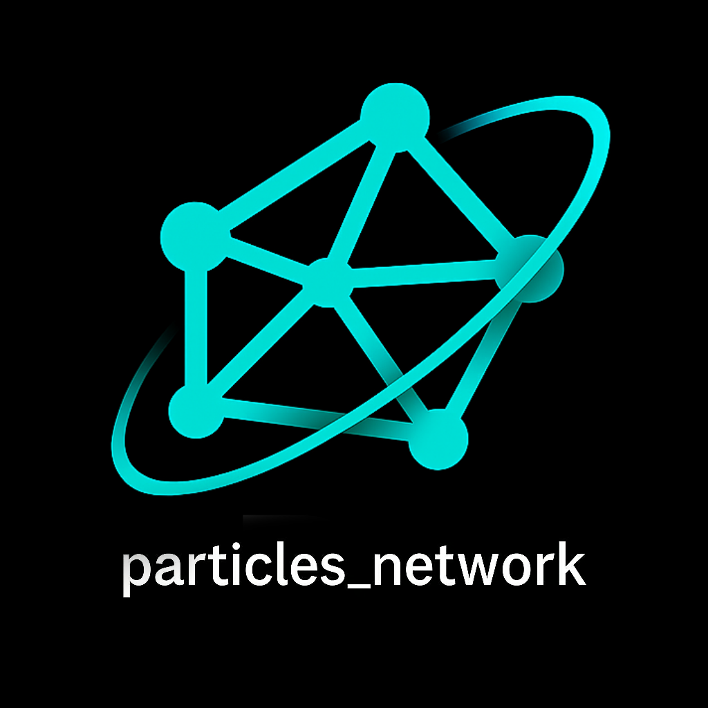
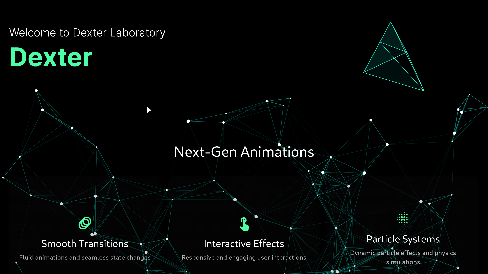

# particles\_network

Transform your Flutter app’s UI with a high-performance particle network animation that responds to touch and adapts seamlessly to any screen size.

<div align="center">
  <a href="https://github.com/abod8639/Particles_Network">
    
  </a>

  <br>
  <a href="https://pub.dev/packages/particles_network">
    </a>
  <a href="https://github.com/abod8639/Particles_Network/actions/workflows/flutter-ci.yml">
    </a>
  <a href="https://opensource.org/licenses/MIT">
    </a>
  <a href="https://codecov.io/gh/abod8639/Particles_Network"></a>
    <a href="https://codecov.io/gh/abod8639/Particles_Network">
     </a>
  
  
</div>

---

## Features

* **Advanced Physics Engine**

  * **Integrated Gravity System**: Support for Global and Point gravity
  * **Interactive Forces**: Create attraction points or repulsion fields
  * **Mass-based Simulation**: Larger particles respond differently to forces
  * **Ultra-High Performance**
    * **GPU-accelerated rendering via Fragment Shaders** for smooth performance
    * Advanced QuadTree spatial partitioning for O(log n) neighbor searches
    * Compressed QuadTree structure for optimal memory usage

* **Rich Customization**

  * Control particle count, speed, size, and colors
  * **Full Gravity Control**: Adjust strength, direction, and type
  * Adjust connection distance and line thickness
  * Enable or disable touch interactions

---

## Demo
<!-- image demo -->

  <!-- git demo -->
<p align="center">
  <h3>Particle Effects Gallery Gif</h3>
  <table align="center">
    <tr align="center">
      <td><b>Default Network</b></td>
      <td><b>Bold Lines</b></td>
      <td><b>Gravity Effect</b></td>
    </tr>
    <tr>
      <td></td>
      <td></td>
      <td></td>
    </tr>
    <tr><td colspan="3" height="10"></td></tr>
    <tr align="center">
      <td><b>Mass Gravity Effect</b></td>
      <td><b>Complex Optimized</b></td>
      <td><b>Particle no stroke</b></td>
    </tr>
    <tr>
      <td></td>
      <td></td>
      <td></td>
    </tr>
  </table>
</p>

---

## Installation

Add the package to your `pubspec.yaml`:

```yaml
dependencies:
  particles_network: ^1.9.2
```

---

## Configuration Options

| Property           | Type          | Default        | Description                                            |
| ------------------ | ------------- | -------------- | ------------------------------------------------------ |
| `particleCount`    | `int`         | `60`           | Number of particles in the system                      |
| `maxSpeed`         | `double`      | `0.5`          | Maximum initial velocity of particles                  |
| `maxSize`          | `double`      | `1.5`          | Maximum particle radius                                |
| `lineWidth`        | `double`      | `0.5`          | Thickness of connection lines                          |
| `lineDistance`     | `double`      | `100`          | Max distance for a connection to form                  |
| `particleColor`    | `Color`       | `Colors.white` | Color of the particles                                 |
| `lineColor`        | `Color`       | `Colors.teal`  | Color of the connections                               |
| `touchColor`       | `Color`       | `Colors.amber` | Highlight color on touch/proximity                     |
| `touchActivation`  | `bool`        | `true`         | Enables interactive touch effects                      |
| `isComplex`        | `bool`        | `false`        | Optimized mode for 500+ particles                      |
| `fill`             | `bool`        | `true`         | Whether to fill or outline particles                   |
| `drawNetwork`      | `bool`        | `true`         | Enables/Disables connection lines                      |
| `gravityType`      | `GravityType` | `none`         | Type of physics simulation (`none`, `global`, `point`) |
| `gravityStrength`  | `double`      | `0.1`          | Intensity of the force ($F = ma$ applied)              |
| `gravityDirection` | `Offset`      | `(0, 1)`       | Direction vector for `GravityType.global`              |
| `gravityCenter`    | `Offset?`     | `center`       | Center coordinates for `GravityType.point`             |

---

## Gravity Simulation Guide

The library now features a realistic physics engine that simulates mass and forces.

### 1. Global Gravity
Simulates a constant force field across the entire viewport (like natural Earth gravity).
* **Usage**: Set `gravityType: GravityType.global`.
* **Direction**: Use `gravityDirection` to control where the particles "fall". `Offset(0, 1)` is down, `Offset(1, 0)` is right.

```dart
ParticleNetwork(
  gravityType: GravityType.global,
  gravityStrength: 0.5,
  gravityDirection: Offset(0, 1), // Standard downward fall
)
```

### 2. Point Gravity (Attractors & Repellers)
Simulates a force emanating from or towards a specific point in space.
* **Attraction (Black Hole)**: Use a **positive** `gravityStrength`. Particles will accelerate towards the `gravityCenter`.
* **Repulsion (Shield)**: Use a **negative** `gravityStrength`. Particles will be pushed away from the `gravityCenter`.

```dart
ParticleNetwork(
  gravityType: GravityType.point,
  gravityStrength: -1.5, // Repulsion effect
  gravityCenter: Offset(width / 2, height / 2),
)
```

> [!NOTE]
> Physical properties like **Mass** are automatically calculated based on the particle's `size`. Larger particles will feel heavier and respond more realistically to the applied forces.


---

## Advanced Usage

### Theme Integration

```dart
AnimatedBuilder(
  animation: Theme.of(context),
  builder: (context, _) => ParticleNetwork(
    particleColor: Theme.of(context).primaryColor,
    lineColor: Theme.of(context).colorScheme.secondary,
    // other configs...
  ),
)
```

### Background Usage

```dart
Stack(
  children: [
    ParticleNetwork(/* configuration */),
    YourAppContent(),
  ],
)
```

### Performance Tips

* Reduce `particleCount` and `lineDistance` for weaker devices
* Use `isComplex: true` for high-density scenes
* Use `fill: false` for better performance and lighter visuals

---

### Simplified API

The package now exports core types directly from the main entry point, making it easier to use without managing multiple imports:

```dart
import 'package:particles_network/particles_network.dart';

// Access directly:
// GravityType, GravityConfig, Particle
```

This package combines advanced CPU-side spatial partitioning with **GPU-side rendering using Fragment Shaders** to achieve optimal performance even with a large number of particles.


The package uses an advanced **Compressed QuadTree** spatial data structure for efficient particle management.

```dart
final quadTree = CompressedQuadTreeNode(
  Rectangle(0, 0, screenWidth, screenHeight),
);

particles.forEach((particle) => 
  quadTree.insert(QuadTreeParticle(
    particle.id, 
    particle.x, 
    particle.y
  ))
);

final nearbyParticles = quadTree.queryCircle(
  touchX, 
  touchY, 
  searchRadius
);
```


* **O(log n)** insertion and query
* Path compression to reduce memory for clustered particles
* Smart node consolidation and rebalancing
* Memory-efficient structure with typed arrays and sparse representation

---

## Contributing

We welcome contributions! See the [contributing guide](https://github.com/abod8639/particles_network/tree/main/CONTRIBUTING.md) for more details.

## License

This package is released under the [MIT License](LICENSE).

---

<div align="center">
  Crafted with care and ❤️  by <a href="https://github.com/abod8639">Dexter</a>
</div>

---

