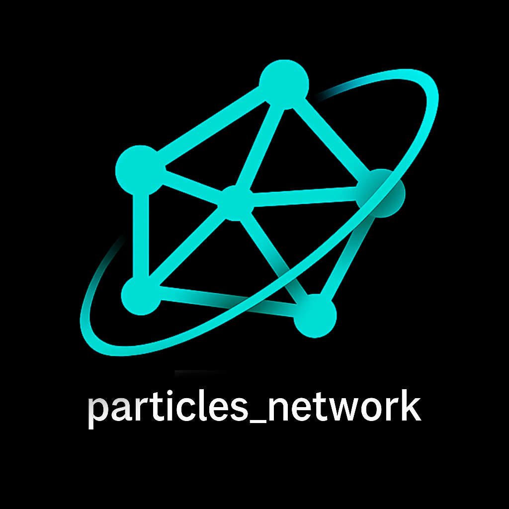

# particles\_network

Transform your Flutter app's UI with a high-performance particle network animation that responds to touch and adapts seamlessly to any screen size.

<div align="center">

#  Particles Network

**High-performance, GPU-accelerated particle systems for Flutter with advanced physics.**

<a href="https://github.com/abod8639/Particles_Network">
  
</a>

<p align="center">

  <a href="https://github.com/abod8639/Particles_Network/actions"></a>
  <a href="https://pub.dev/packages/particles_network"></a>
  <a href="https://codecov.io/gh/abod8639/Particles_Network"></a>
  <a href="https://opensource.org/licenses/MIT"></a>
</p>

<p align="center">
  <a href="https://github.com/abod8639/Particles_Network/stargazers"></a>
  
  
  <a href="https://particle-network-example.web.app"></a>
</p>

---

<p align="center">
  <a href="https://github.com/abod8639/Particles_Network"><b>GitHub</b></a> •
  <a href="https://pub.dev/packages/particles_network"><b>Pub.dev</b></a> •
  <a href="https://particle-network-example.web.app"><b>Live Demo</b></a> •
  <a href="#-gravity-simulation-guide"><b>Documentation</b></a>
</p>

</div>

---

## Table of Contents

- [Features](#features)
- [Demo](#demo)
- [Live Demo](#live-demo)
- [Use Cases](#use-cases)
- [Performance Benchmarks](#performance-benchmarks)
- [Quick Start](#quick-start)
- [Installation](#installation)
- [Platform Support](#platform-support)
- [Configuration Options](#configuration-options)
  - [Touch Features Configuration](#touch-features-configuration)
- [Gravity Simulation Guide](#gravity-simulation-guide)
  - [Global Gravity](#1-global-gravity)
  - [Point Gravity](#2-point-gravity-attractors--repellers)
- [Advanced Usage](#advanced-usage)
  - [Theme Integration](#theme-integration)
  - [Background Usage](#background-usage)
  - [Performance Tips](#performance-tips)
- [Architecture & Performance](#architecture--performance)
  - [Adaptive Performance Scaling](#adaptive-performance-scaling)
  - [Fast Single-Call Line Rendering](#fast-single-call-line-rendering)
  - [Bounded O(N) Connection Scaling](#bounded-on-connection-scaling)
  - [GPU-Accelerated Rendering](#gpu-accelerated-rendering)
  - [Spatial Partitioning](#spatial-partitioning)
  - [Zero-Allocation Color LUT](#zero-allocation-color-lut)
  - [Touch Inactivity Bypass](#touch-inactivity-bypass)
  - [Deterministic Trajectory Precomputation](#deterministic-trajectory-precomputation)
- [Examples](#examples)
- [Troubleshooting](#troubleshooting)
- [FAQ](#faq)
- [Migration Guide](#migration-guide)
- [Credits & Acknowledgments](#credits--acknowledgments)
- [Contributing](#contributing)
- [License](#license)

---

## Features

* **Advanced Physics Engine**

  * **Integrated Gravity System**: Support for Global and Point gravity
  * **Interactive Forces**: Create attraction points or repulsion fields
  * **Mass-based Simulation**: Larger particles respond differently to forces
  * **True Trajectory Preservation**: Maintains natural velocity direction vectors during particle deceleration and inertia settling
  * **Ultra-High Performance & Zero Allocations**
    * **Adaptive Performance Scaling (`enableAdaptivePerformance`)**: Real-time FPS monitoring with `AdaptivePerformanceController` that auto-adjusts connection density and rendering quality to maintain stable 60/120 FPS under heavy loads.
    * **Fast Single-Call Line Rendering (`fastLineRendering`)**: Batched point-to-point drawing pipeline minimizing CPU-to-GPU state transitions.
    * **$O(N)$ Connection Limiting (`maxConnectionsPerParticle`)**: Bounded connection capacity per node, eliminating $O(N^2)$ slowdowns in dense scenes.
    * **Adaptive Density (`adaptiveDensity`)**: Automatically scales connection radius in dense particle regions to prevent visual clutter and CPU bottlenecks.
    * **Zero-Allocation Color LUT (`_lineColorLut`)**: Precomputed 256-level alpha lookup table with inverse distance precomputation ($255.0 / \text{lineDistance}$), completely eliminating `Color` allocations and GC overhead during connection rendering.
    * **Touch Inactivity Bypass (`isTouchActive`)**: Skips all touch physics calculations, distance queries, and forced QuadTree rebuilds when the screen is idle.
    * **Precalculated Trajectory Buffer (`TrajectoryBuffer`)**: Deterministic trajectory precomputation during idle states for smooth 120 FPS playback with zero per-frame physics computation.
    * **GPU-accelerated rendering via Fragment Shaders** for smooth performance
    * Advanced QuadTree spatial partitioning for O(log n) neighbor searches
    * Compressed QuadTree structure for optimal memory usage

* **Rich Customization**

  * Control particle count, speed, size, and colors
  * **Full Gravity Control**: Adjust strength, direction, and type
  * **Advanced Touch Physics (`TouchFeatures`)**: Fine-grained control over attraction force, damping, velocity cap, and smooth deceleration decay rates
  * Adjust connection distance and line thickness
  * Enable or disable touch interactions and hover tracking

---

## Demo
<!-- image demo -->

  <!-- git demo -->
<p align="center">
  <h3>Particle Effects</h3>
  
  <table align="center">
    <tr align="center">
      <td><b>Default Network</b></td>
      <td><b>Bold Lines</b></td>
      <td><b>Gravity Effect</b></td>
    </tr>
    <tr>
      <td></td>
      <td></td>
      <td></td>
    </tr>
    <tr><td colspan="3" height="10"></td></tr>
    <tr align="center">
      <td><b>Mass Gravity Effect</b></td>
      <td><b>Complex Optimized</b></td>
      <td><b>Particle no stroke</b></td>
    </tr>
    <tr>
      <td></td>
      <td></td>
      <td></td>
    </tr>
  </table>
</p>

---

## Live Demo

Experience the performance and fluid animations directly in your browser:

<p align="center">
  <a href="https://particle-network-example.web.app">
    
  </a>
</p>

> [!TIP]
> For the best experience on web, our demo uses **CanvasKit** rendering to ensure smooth 60 FPS performance for the particle physics and shaders.

---

## Use Cases

Perfect for creating stunning visual effects in:

- **Landing Pages** - Create memorable first impressions
- **Game Backgrounds** - Add dynamic ambiance to game menus
- **App Onboarding** - Engage users with interactive tutorials
- **Portfolio Sites** - Showcase your creativity
- **Marketing Pages** - Capture attention with motion
- **Data Visualization** - Animated backgrounds for dashboards
- **Event Websites** - Create excitement and energy

---

## Performance Benchmarks

| Metric | Before Optimization | After Optimization | Improvement |
| :--- | :---: | :---: | :---: |
| **Rendering 100 frames (500 particles)** | **4,608 ms** (~46 ms/frame) | **496 ms** (~4.9 ms/frame) | **9.3x Faster (89.2% reduction)** |
| **Physics Update Loop (1,000 particles, 1,000 frames)** | ~120 ms | **45 ms** | **2.6x Faster** |
| **Framerate (500 particles)** | ~21 FPS | **> 120 FPS** | Ultra-fluid rendering |
| **Connection Color Allocations** | Thousands of `Color` instances/sec | **0 allocations (`_lineColorLut`)** | **100% GC pressure eliminated** |
| **Touch calculations when idle** | Executed every frame | **0 calculations (`isTouchActive`)** | **100% idle overhead eliminated** |

> [!NOTE]
> Performance may vary based on device specifications, screen resolution, and other running applications. These benchmarks use default settings with `drawNetwork: true` and `fill: true`.

---

## Quick Start

```dart
import 'package:flutter/material.dart';
import 'package:particles_network/particles_network.dart';

void main() {
  runApp(const MyApp());
}

class MyApp extends StatelessWidget {
  const MyApp({super.key});

  @override
  Widget build(BuildContext context) {
    return MaterialApp(
      home: Scaffold(
        backgroundColor: Colors.black,
        body: ParticleNetwork(
          particleCount: 100,
          maxSpeed: 1.5,
          maxSize: 1.5,
          lineWidth: 1.0,
          lineDistance: 100,
          particleColor: Colors.white,
          lineColor: Colors.teal,
          touchColor: Colors.amber,
          touchActivation: true,
          isComplex: false,
          fill: true,
          drawNetwork: true,
          gravityType: GravityType.none,
          gravityStrength: 0.1,
          gravityDirection: const Offset(0, 1),
          gravityCenter: null,
          hoverEffect: true,
        ),
      ),
    );
  }
}
```

---

## Installation

Add the package to your `pubspec.yaml`:

```yaml
dependencies:
  particles_network: ^1.9.6
```

Then run:

```bash
flutter pub get
```

### Platform-Specific Setup

#### Web (Recommended)
For optimal performance on web, use **CanvasKit** renderer:

```bash
# Development
flutter run -d chrome --wasm
# Production build
flutter build web --wasm
```

#### Mobile (Android/iOS)
No additional setup required! The package works out of the box.

#### Desktop (Windows/macOS/Linux)
No additional setup required! The package works out of the box.

---

## Platform Support

| Platform | Support | Performance | Notes                         |
|----------|---------|-------------|-------------------------------|
|  Android | ✅ Full |  Excellent  | Hardware acceleration enabled |
|  iOS     | ✅ Full |  Excellent  | Optimized for Metal rendering |
|  Web     | ✅ Full |  Very Good  | Best with CanvasKit renderer  |
|  Windows | ✅ Full |  Excellent  | DirectX acceleration          |
|  macOS   | ✅ Full |  Excellent  | Metal acceleration            |
|  Linux   | ✅ Full |  Very Good  | OpenGL acceleration           |

**Minimum Requirements:**
- Flutter SDK: `>=3.10.0`
- Dart SDK: `^3.0.0`

---

## Configuration Options

| Property                     | Type            | Default        | Description                                                          |
| ---------------------------- | --------------- | -------------- | -------------------------------------------------------------------- |
| `particleCount`              | `int`           | `60`           | Number of particles in the system                                    |
| `maxSpeed`                   | `double`        | `0.5`          | Maximum initial velocity of particles                                |
| `maxSize`                    | `double`        | `1.5`          | Maximum particle radius                                              |
| `lineWidth`                  | `double`        | `0.5`          | Thickness of connection lines                                        |
| `lineDistance`               | `double`        | `100`          | Max distance for a connection to form                                |
| `particleColor`              | `Color`         | `Colors.white` | Color of the particles                                               |
| `lineColor`                  | `Color`         | `Colors.teal`  | Color of the connections                                             |
| `touchColor`                 | `Color`         | `Colors.amber` | Highlight color on touch/proximity                                   |
| `touchActivation`            | `bool`          | `true`         | Enables interactive touch effects                                    |
| `touchFeatures`              | `TouchFeatures` | `const TouchFeatures()` | Fine-grained touch dynamics (force, damping, decay rate, max speed) |
| `hoverEffect`                | `bool?`         | `false`        | Enables/Disables mouse hover effects (Web & Desktop)                 |
| `isComplex`                  | `bool`          | `false`        | Optimized mode for 500+ particles                                    |
| `fill`                       | `bool`          | `true`         | Whether to fill or outline particles                                 |
| `drawNetwork`                | `bool`          | `true`         | Enables/Disables connection lines                                    |
| `maxConnectionsPerParticle`  | `int?`          | `null`         | Bounding edge limit per node to $O(N)$ for massive performance boost |
| `adaptiveDensity`            | `bool`          | `false`        | Automatically scales down connection distance in dense networks      |
| `fastLineRendering`          | `bool`          | `false`        | Single draw-call line rendering (alias: `useVerticesRendering`)      |
| `enableAdaptivePerformance`  | `bool`          | `false`        | Dynamically monitors FPS and auto-tunes quality to maintain 60 FPS   |
| `gravityType`                | `GravityType`   | `none`         | Type of physics simulation (`none`, `global`, `point`)               |
| `gravityStrength`            | `double`        | `0.1`          | Intensity of the force ($F = ma$ applied)                            |
| `gravityDirection`           | `Offset`        | `(0, 1)`       | Direction vector for `GravityType.global`                            |
| `gravityCenter`              | `Offset?`       | `center`       | Center coordinates for `GravityType.point`                           |

### Touch Features Configuration

The `TouchFeatures` class provides granular physics parameters for interactive gestures:

| Property | Type | Default | Description |
| :--- | :--- | :--- | :--- |
| `force` / `pullForce` | `double` | `0.42` | Attraction pull force towards the active pointer position |
| `speed` / `decayRate` | `double` | `0.42` | Settling rate controls how smoothly particles return to cruising speed after touch release |
| `damping` | `double` | `0.985` | Fluid drag coefficient applied to particles within the touch field |
| `maxTouchSpeed` | `double` | `5.5` | Strict velocity cap during touch attraction |
| `lineDistance` | `double?` | `null` | Custom connection distance around touch point (defaults to network `lineDistance`) |

---

## Gravity Simulation Guide

The library now features a realistic physics engine that simulates mass and forces.

### 1. Global Gravity
Simulates a constant force field across the entire viewport (like natural Earth gravity).
* **Usage**: Set `gravityType: GravityType.global`.
* **Direction**: Use `gravityDirection` to control where the particles "fall". `Offset(0, 1)` is down, `Offset(1, 0)` is right.

```dart
ParticleNetwork(
  gravityType: GravityType.global,
  gravityStrength: 0.5,
  gravityDirection: Offset(0, 1), // Standard downward fall
)
```

### 2. Point Gravity (Attractors & Repellers)
Simulates a force emanating from or towards a specific point in space.
* **Attraction (Black Hole)**: Use a **positive** `gravityStrength`. Particles will accelerate towards the `gravityCenter`.
* **Repulsion (Shield)**: Use a **negative** `gravityStrength`. Particles will be pushed away from the `gravityCenter`.

```dart
ParticleNetwork(
  gravityType: GravityType.point,
  gravityStrength: -1.5, // Repulsion effect
  gravityCenter: Offset(width / 2, height / 2),
)
```

> [!NOTE]
> Physical properties like **Mass** are automatically calculated based on the particle's `size`. Larger particles will feel heavier and respond more realistically to the applied forces.


---

## Advanced Usage

### Theme Integration

```dart
AnimatedBuilder(
  animation: Theme.of(context),
  builder: (context, _) => ParticleNetwork(
    particleColor: Theme.of(context).primaryColor,
    lineColor: Theme.of(context).colorScheme.secondary,
    // other configs...
  ),
)
```

### Background Usage

```dart
Stack(
  children: [
    ParticleNetwork(/* configuration */),
    YourAppContent(),
  ],
)
```

### Performance Tips

* Reduce `particleCount` and `lineDistance` for weaker devices
* Use `isComplex: true` for high-density scenes
* Use `fill: false` for better performance and lighter visuals

---

### Simplified API

The package now exports core types directly from the main entry point, making it easier to use without managing multiple imports:

```dart
import 'package:particles_network/particles_network.dart';

// Access directly:
// GravityType, GravityConfig, Particle
```

---

## Architecture & Performance

This package combines advanced CPU-side spatial partitioning with **GPU-side rendering using Fragment Shaders** and dynamic runtime governors to achieve optimal performance even with high particle counts.

### Adaptive Performance Scaling

The `AdaptivePerformanceController` actively monitors real-time frame rate to eliminate stutter on lower-end devices or during sudden rendering spikes:
- Automatically throttles connection density and max connection ranges when frame delivery time exceeds threshold.
- Automatically restores full quality when performance headroom recovers.
- Activated by simply setting `enableAdaptivePerformance: true`.

### Fast Single-Call Line Rendering

Traditional custom painters invoke `canvas.drawLine` repeatedly for every pair of connected particles, resulting in hundreds of CPU-GPU transitions per frame.
- Enabling `fastLineRendering: true` batches connection endpoints into a single flat point buffer.
- Drastically reduces draw-call overhead on both **Impeller** and **CanvasKit/WASM** rendering engines.

### Bounded $O(N)$ Connection Scaling

In dense networks, pairwise proximity checks can generate up to $\frac{N(N-1)}{2}$ edges ($O(N^2)$), causing frame rates to collapse at 500+ particles.
- Setting `maxConnectionsPerParticle: 4` (or similar) enforces an upper bound on connection degree per particle.
- Limits total line segments to a predictable $O(N)$ upper bound, enabling smooth rendering of 1,000+ particles.

### GPU-Accelerated Rendering

The particle network uses **Fragment Shaders** for rendering, which offloads the drawing work to the GPU. This allows for:
- Smooth 60 FPS performance even with 500+ particles
- Efficient rendering of complex visual effects
- Reduced CPU usage for better battery life

> [!TIP]
> For web deployments, compile with WebAssembly (`--wasm`) for hardware-accelerated CanvasKit / Skwasm shader performance.

### Spatial Partitioning

The package uses an advanced **Compressed QuadTree** spatial data structure for efficient particle management.

```dart
final quadTree = CompressedQuadTreeNode(
  Rectangle(0, 0, screenWidth, screenHeight),
);

particles.forEach((particle) => 
  quadTree.insert(QuadTreeParticle(
    particle.id, 
    particle.x, 
    particle.y
  ))
);

final nearbyParticles = quadTree.queryCircle(
  touchX, 
  touchY, 
  searchRadius
);
```


**Key Benefits:**
* **O(log n)** insertion and query complexity
* Path compression to reduce memory for clustered particles
* Smart node consolidation and rebalancing
* Memory-efficient structure with typed arrays and sparse representation

### Zero-Allocation Color LUT (`_lineColorLut`)

To prevent micro-stutters and frame drops caused by Garbage Collector (GC) pauses during connection rendering:
- **Precomputed 256-Level Alpha Table**: A lookup table `List<Color> _lineColorLut` stores all 256 opacity gradations for the configured `lineColor`.
- **Precomputed Inverse Distance**: Precalculates the inverse distance constant ($255.0 / \text{lineDistance}$) upon initialization.
- **Zero Allocations**: Replaces expensive dynamic `color.withAlpha(...)` allocations and division operations per connection with an instantaneous $O(1)$ table lookup, eliminating thousands of short-lived `Color` objects per second from the heap.
### Deterministic Trajectory Precomputation (`TrajectoryBuffer`)

- Precomputes future particle coordinates and velocities in a compact, flat `Float64List` buffer when the screen is idle.
- Eliminates per-frame CPU physics calculation during unattended playback.
- Seamlessly falls back to real-time physics calculation when touched, and smoothly regenerates future trajectory batches once touch ends.

---

## Examples

### 1. Simple Background Animation

```dart
import 'package:flutter/material.dart';
import 'package:particles_network/particles_network.dart';

class HomePage extends StatelessWidget {
  @override
  Widget build(BuildContext context) {
    return Scaffold(
      body: Stack(
        children: [
          // Particle background
          ParticleNetwork(
            particleCount: 80,
            maxSpeed: 1.0,
            particleColor: Colors.blue.shade200,
            lineColor: Colors.blue.shade100,
            touchActivation: false,
          ),
          // Your content
          Center(
            child: Text(
              'Welcome',
              style: TextStyle(fontSize: 48, color: Colors.white),
            ),
          ),
        ],
      ),
    );
  }
}
```

### 2. Interactive Touch Effect

```dart
ParticleNetwork(
  particleCount: 120,
  maxSpeed: 2.0,
  lineDistance: 150,
  touchActivation: true,
  touchColor: Colors.amber,
  particleColor: Colors.white,
  lineColor: Colors.teal,
)
```

### 3. Gravity Simulation - Falling Particles

```dart
ParticleNetwork(
  particleCount: 100,
  gravityType: GravityType.global,
  gravityStrength: 0.5,
  gravityDirection: Offset(0, 1), // Downward
  particleColor: Colors.white,
  lineColor: Colors.blue,
)
```

### 4. Black Hole Effect

```dart
ParticleNetwork(
  particleCount: 150,
  gravityType: GravityType.point,
  gravityStrength: 1.2, // Positive = attraction
  gravityCenter: Offset(screenWidth / 2, screenHeight / 2),
  particleColor: Colors.purple,
  lineColor: Colors.purpleAccent,
)
```

### 5. Repulsion Field

```dart
ParticleNetwork(
  particleCount: 100,
  gravityType: GravityType.point,
  gravityStrength: -1.5, // Negative = repulsion
  gravityCenter: Offset(screenWidth / 2, screenHeight / 2),
  particleColor: Colors.red,
  lineColor: Colors.orange,
)
```

### 6. High-Density Optimized Scene

```dart
ParticleNetwork(
  particleCount: 400,
  lineDistance: 60,
  isComplex: true, // Enable optimization for 500+ particles
  maxSpeed: 0.8,
  fill: false, // Outline mode for better performance
  particleColor: Colors.cyan,
  lineColor: Colors.cyanAccent,
)
```

### 7. Dynamic Theme-Aware Particles

```dart
class ThemedParticles extends StatelessWidget {
  @override
  Widget build(BuildContext context) {
    final isDark = Theme.of(context).brightness == Brightness.dark;
    
    return ParticleNetwork(
      particleCount: 100,
      particleColor: isDark ? Colors.white : Colors.black,
      lineColor: isDark ? Colors.teal : Colors.blue,
      touchColor: Theme.of(context).colorScheme.primary,
    );
  }
}
```

### 8. Adaptive Performance & Fluid Touch Dynamics (New in 1.9.6)

```dart
ParticleNetwork(
  particleCount: 200,
  maxSpeed: 0.8,
  lineDistance: 120,
  particleColor: Colors.white,
  lineColor: Colors.cyanAccent,
  // 1.9.6 Adaptive Performance Options:
  enableAdaptivePerformance: true, // Dynamically maintains 60 FPS
  fastLineRendering: true,          // Batched single-call rendering
  maxConnectionsPerParticle: 4,     // Limits edge complexity to O(N)
  adaptiveDensity: true,           // Scales distance in crowded spots
  // 1.9.6 Advanced Touch Dynamics:
  touchActivation: true,
  touchFeatures: const TouchFeatures(
    force: 0.5,                    // Attraction pull intensity
    damping: 0.985,                // Viscous fluid drag
    maxTouchSpeed: 5.0,            // Speed limit during touch
    decayRate: 0.02,               // Smooth deceleration settling rate
  ),
)
```

---

## Troubleshooting

### Issue: Low FPS on Web

**Solution:** Compile using WebAssembly (`--wasm`) for maximum performance with Skwasm and CanvasKit:
```bash
# Development
flutter run -d chrome --wasm

# Production build
flutter build web --wasm
```

### Issue: Particles Not Visible

**Possible Causes:**
1. **Color Mismatch**: Ensure `particleColor` contrasts with the background
2. **Size Too Small**: Increase `maxSize` parameter (default is 1.5)
3. **Count Too Low**: Increase `particleCount` for more visibility

**Solution:**
```dart
ParticleNetwork(
  particleCount: 100, // Increase if needed
  maxSize: 3.0,       // Make particles larger
  particleColor: Colors.white, // Ensure contrast
  // ...
)
```

### Issue: Touch Interaction Not Working

**Solution:** Ensure `touchActivation` is set to `true`:
```dart
ParticleNetwork(
  touchActivation: true,
  touchColor: Colors.amber, // Visible highlight color
  // ...
)
```

### Issue: Performance Degradation with Many Particles

**Solution:** Enable complex mode and optimize settings:
```dart
ParticleNetwork(
  particleCount: 500,
  isComplex: true,        // Enable optimization
  fill: false,            // Use outline mode
  lineDistance: 80,       // Reduce connection distance
  drawNetwork: true,      // Can disable if needed
  // ...
)
```

### Issue: Gravity Not Working

**Solution:** Ensure gravity type is set correctly:
```dart
// For global gravity
ParticleNetwork(
  gravityType: GravityType.global,  // Must be set
  gravityStrength: 0.5,              // Non-zero value
  gravityDirection: Offset(0, 1),    // Direction vector
)

// For point gravity
ParticleNetwork(
  gravityType: GravityType.point,    // Must be set
  gravityStrength: 1.0,              // Non-zero value
  gravityCenter: Offset(200, 200),   // Valid coordinates
)
```

---

## FAQ

### Q: What's the recommended particle count?

**A:** It depends on your target platform:
- **Mobile**: 60-150 particles for smooth 60 FPS
- **Web (CanvasKit)**: 100-300 particles
- **Desktop**: 200-500 particles
- **High-end devices with `isComplex: true`**: 500-1000 particles

### Q: Can I use this as a background widget?

**A:** Yes! Simply wrap it in a `Stack`:
```dart
Stack(
  children: [
    ParticleNetwork(/* config */),
    YourContent(),
  ],
)
```

### Q: Does this work on all platforms?

**A:** Yes! The package supports:
- ✅ Android
- ✅ iOS
- ✅ Web (best with CanvasKit)
- ✅ Windows
- ✅ macOS
- ✅ Linux

### Q: How do I create a "snow falling" effect?

**A:** Use global gravity with downward direction:
```dart
ParticleNetwork(
  gravityType: GravityType.global,
  gravityStrength: 0.3,
  gravityDirection: Offset(0, 1),
  particleColor: Colors.white,
  maxSpeed: 0.5,
)
```

### Q: Can I disable the connection lines?

**A:** Yes, set `drawNetwork: false`:
```dart
ParticleNetwork(
  drawNetwork: false,
  // ...
)
```

### Q: What's the difference between `fill: true` and `fill: false`?

**A:** 
- `fill: true` - Particles are filled circles (default, more visible)
- `fill: false` - Particles are outlined circles (better performance, lighter look)

### Q: How do I make particles respond to mouse/touch?

**A:** Enable touch activation:
```dart
ParticleNetwork(
  touchActivation: true,
  touchColor: Colors.amber, // Highlight color
  lineDistance: 150,        // Interaction radius
)
```

Note: Some properties like `particleCount`, `maxSpeed`, and `maxSize` require a widget rebuild to take effect. You can force this by changing the widget's `key`.

---

## Migration Guide

### Migrating to 1.9.6

Version 1.9.6 is **100% backward compatible** with all existing `1.x` implementations.

**New Capabilities in 1.9.6:**
- **Dynamic FPS Governor**: Enable `enableAdaptivePerformance: true` for automatic quality adaptation.
- **Fast Line Rendering**: Enable `fastLineRendering: true` to minimize GPU draw calls.
- **Connection Degree Limiter**: Set `maxConnectionsPerParticle` to cap connections per particle and eliminate $O(N^2)$ spikes.
- **Density Adaptation**: Enable `adaptiveDensity: true` to auto-scale connection radius in dense clusters.
- **Fine-Grained Touch Physics**: Pass `touchFeatures: TouchFeatures(...)` for customized drag, pull, damping, and decay rate.

**Example Migration Config:**
```dart
ParticleNetwork(
  // Existing parameters remain unchanged:
  particleCount: 150,
  particleColor: Colors.white,
  lineColor: Colors.teal,

  // New in 1.9.6 (all optional):
  enableAdaptivePerformance: true,
  fastLineRendering: true,
  maxConnectionsPerParticle: 4,
  adaptiveDensity: true,
  touchFeatures: const TouchFeatures(
    force: 0.45,
    damping: 0.98,
    maxTouchSpeed: 5.0,
    decayRate: 0.015,
  ),
)
```

**Recommended Updates:**
1. Update your `pubspec.yaml`:
   ```yaml
   dependencies:
     particles_network: ^1.9.6
   ```

2. Run:
   ```bash
   flutter pub get
   ```

---

## Credits & Acknowledgments

This package is built with:
- **Flutter** - Google's UI toolkit for building beautiful, natively compiled applications
- **Fragment Shaders** - GPU-accelerated rendering for optimal performance
- **QuadTree Algorithm** - Efficient spatial partitioning for particle management

**Inspired by:**
- Classic particle.js effects
- Modern web animation libraries
- Physics simulation principles

**Special Thanks:**
- The Flutter team for the amazing framework
- The open-source community for continuous feedback and contributions
- All developers who have starred, used, and contributed to this package

---

## Contributing

We welcome contributions! See the [contributing guide](https://github.com/abod8639/particles_network/tree/main/CONTRIBUTING.md) for more details.

**Ways to Contribute:**
- Report bugs via [GitHub Issues](https://github.com/abod8639/Particles_Network/issues)
- Suggest features or improvements
- Improve documentation
- Submit pull requests
- Star the repository if you find it useful!

## License

This package is released under the [MIT License](LICENSE).

---

<div align="center">
  Crafted with care and ❤️  by <a href="https://github.com/abod8639">Dexter</a>
</div>

---
