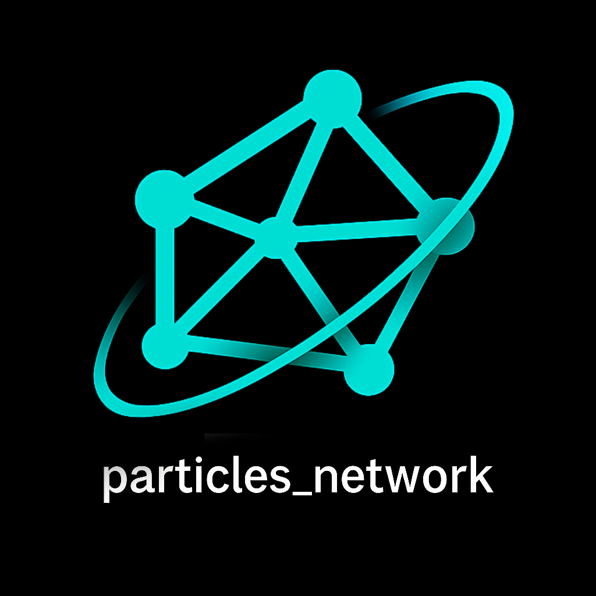

<!--
This README describes the package. If you publish this package to pub.dev,
this README's contents appear on the landing page for your package.

For information about how to write a good package README, see the guide for
[writing package pages](https://dart.dev/tools/pub/writing-package-pages).

For general information about developing packages, see the Dart guide for
[creating packages](https://dart.dev/guides/libraries/create-packages)
and the Flutter guide for
[developing packages and plugins](https://flutter.dev/to/develop-packages).
-->

<!-- markdownlint-disable MD013 -->
<!-- <p align="center">
  <a href="https://docs.flutter.dev/packages-and-plugins/favorites">
    
  </a>
</p> -->
<p align="center">
  <a href="https://github.com/abod8639/Particles_Network">
    
  </a>
</p>


---
## Documentation
 
# particles_network

A highly optimized Flutter package that creates an interactive particle network effect with smooth animations and touch interactions. The package creates a visually appealing network of particles connected by lines that respond to touch input.

## Features


- 🚀 Highly optimized rendering using spatial partitioning
- 🎨 Customizable particle appearance (color, size, count)
- 🔗 Dynamic line connections between nearby particles
- 👆 Interactive touch response with particle attraction
- 🎯 Smooth particle movement with natural physics
- 📱 Responsive to screen size changes for consistent layout across devices
- ⚡ Memory-efficient with smart distance caching and compact typed arrays (e.g. Uint16List)
- 🧠 Optimized data structures: fast hashing, minimal allocations, reduced garbage

## Image 


### touchActivation

## Getting started

Add this package to your Flutter project by adding the following to your `pubspec.yaml`:

```yaml
dependencies:
  particles_network: ^1.5.6
```

## Usage

Here's a simple example of how to use the Particles Network widget:


```dart
import 'package:flutter/material.dart';
import 'package:particles_network/particles_network.dart';

void main() {
  runApp(const MyApp());
}

class MyApp extends StatelessWidget {
  const MyApp({super.key});

  @override
  Widget build(BuildContext context) {
    return MaterialApp(
      home: Scaffold(
        backgroundColor: Colors.black,
        body: ParticleNetwork(
          touchActivation: true,         // to Activate touch
          particleCount: 50,            // Number of particles
          maxSpeed: 0.5,                // Maximum particle speed
          maxSize: 3.5,                 // Maximum particle size
          lineDistance: 150,            // Maximum distance for connecting lines
          particleColor: Colors.white,
          lineColor: const Color(0xFF4CFFA7),
          touchColor: Colors.amber,
        ),
      ),
    );
  }
}

```

## Customization


The `OptimizedParticleNetwork` widget accepts several parameters for customization:

- `particleCount`: Number of particles in the system (default: 50).
- `maxSpeed`: Maximum velocity of particles (default: 0.5)
- `maxSize`: Maximum size of particles (default: 3.5)
- `lineDistance`: Maximum distance for drawing connecting lines (default: 100)
- `particleColor`: Color of the particles (default: white)
- `lineColor`: Color of connecting lines between particles (default: teal)
- `touchColor`: Color of lines created by touch interaction (default: amber)

- ⚠️ Performance Tip:
To ensure optimal performance, maintain a good balance between particleCount and lineDistance.
High values for both can significantly increase the number of line calculations, which may impact rendering speed.
For example, if particleCount is high, consider reducing lineDistance, and vice versa.
## Performance Optimization


The package uses several optimization techniques:

1. **Spatial Partitioning**: Divides the space into a grid to reduce particle distance calculations
2. **Distance Caching**: Caches distances between particles to avoid recalculations
3. **Efficient Repainting**: Only repaints when necessary using smart `shouldRepaint` checks
4. **Memory Management**: Clears caches each frame to prevent memory growth

## Additional Information

- Package is optimized for both mobile and web platforms
- Supports both light and dark themes
- Compatible with Flutter's widget tree and can be used in any container
- Automatically handles screen size changes and orientation changes

## License

This project is licensed under the MIT License - see the LICENSE file for details.

## Contributing

Contributions are welcome! Feel free to submit issues and pull requests.
