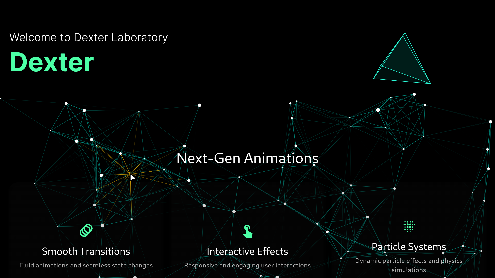

# 🌟 particles_network

Transform your Flutter app's UI with a breathtaking, high-performance particle network animation that reacts to touch and adapts seamlessly to any screen size.

<div align="center">
  <a href="https://github.com/abod8639/Particles_Network">
    
  </a>

  [](https://pub.dev/packages/particles_network)
  [](https://github.com/abod8639/Particles_Network )
  
  

  
  

</div>


## ✨ Features

* 🚀 **Ultra-High Performance**
  * Advanced QuadTree spatial partitioning for O(log n) neighbor searches
  * Compressed QuadTree structure for optimal memory usage
  * Smart distance caching to minimize calculations
  * Efficient memory management with frame-scoped caches
  
* 🎨 **Rich Customization**
  * Control particle count, speed, size, and colors
  * Adjust connection distance and line thickness
  * Enable/disable touch interactions
  
* 🔄 **Responsive Design**
  * Auto-adapts to any screen size or orientation
  * Smooth animations at 60+ FPS
  * Touch-responsive with configurable effects

## 🎬 Demo




 
 ## GIF
<div align="lift">
  
</div>

## 📦 Installation

Add to your `pubspec.yaml`:

```yaml
dependencies:
  particles_network: ^1.7.9
```
```bash
flutter pub get
```


### Or use Flutter CLI:

```bash
flutter pub add particles_network
```

## 🚀 Quick Start

```dart
import 'package:flutter/material.dart';
import 'package:particles_network/particles_network.dart';

void main() => runApp(const MyApp());

class MyApp extends StatelessWidget {
  const MyApp({super.key});

  @override
  Widget build(BuildContext context) {
    return MaterialApp(
      debugShowCheckedModeBanner: false,
      home: Scaffold(
        backgroundColor: Colors.black,
        body: ParticleNetwork(
          particleCount: 60,          // Number of particles
          maxSpeed: 0.7,              // Maximum velocity
          maxSize: 3.5,               // Particle size
          lineDistance: 180,          // Connection distance
          particleColor: Colors.white,
          lineColor: const Color(0xFF4CFFA7),
          touchColor: Colors.amber,    // Color on touch
          touchActivation: true,      // Enable touch
          drawnetwork: true,          // Show connections
          fill: false,                // Outline particles
          isComplex: false,           // Optimize performance
        ),
      ),
    );
  }
}
```

## ⚙️ Configuration

| Property | Type | Default | Description |
|----------|------|---------|-------------|
| `particleCount` | `int` | `50` | Number of particles in the system |
| `maxSpeed` | `double` | `0.5` | Maximum particle velocity |
| `maxSize` | `double` | `3.5` | Maximum particle radius |
| `lineDistance` | `double` | `100` | Maximum connection distance |
| `particleColor` | `Color` | `Colors.white` | Particle color |
| `lineColor` | `Color` | `Colors.teal` | Connection line color |
| `touchColor` | `Color` | `Colors.amber` | Touch highlight color |
| `touchActivation` | `bool` | `false` | Enable touch interaction |
| `drawnetwork` | `bool` | `true` | Show particle connections |
| `fill` | `bool` | `true` | Fill vs outline particles |
| `isComplex` | `bool` | `false` | Optimize complex scenes |
| `linewidth` | `double` | `0.5` | Connection line thickness |

## 🎯 Advanced Usage

### Theme Integration

Animate colors based on app theme:

```dart
AnimatedBuilder(
  animation: Theme.of(context),
  builder: (context, _) => ParticleNetwork(
    particleColor: Theme.of(context).primaryColor,
    lineColor: Theme.of(context).accentColor,
    // ... other properties
  ),
)
```

### Custom Layout Integration

Use as a background or overlay:

```dart
Stack(
  children: [
    ParticleNetwork(/* ... */),
    YourContent(),
  ],
)
```

### Performance Tips

- Reduce `particleCount` and `lineDistance` for better performance on low-end devices
- Set `isComplex: true` for scenes with many particles
- Use `fill: false` for a lighter visual style that's also more performant

## 🔧 Under the Hood

- **QuadTree Implementation**: 
  - Uses an optimized compressed QuadTree data structure
  - Automatically subdivides space for O(log n) neighbor searches
  - Path compression for reduced memory footprint
  - Dynamic node consolidation for optimal tree structure
- **Distance Caching**: Stores recent calculations to avoid redundant math
- **Smart Repainting**: Uses Flutter's `shouldRepaint` for optimal rendering
- **Memory Management**: 
  - Employs typed arrays and scoped caches
  - Compressed node representation for dense particle clusters
  - Automatic tree rebalancing for optimal performance


## 🔬 Technical Details

### QuadTree Implementation

The package uses a sophisticated compressed QuadTree data structure for spatial partitioning:

```dart
// Example of how particles are organized in the QuadTree
final quadTree = CompressedQuadTreeNode(
  Rectangle(0, 0, screenWidth, screenHeight),
);

// Particles are automatically organized into quadrants
particles.forEach((particle) => 
  quadTree.insert(QuadTreeParticle(
    particle.id, 
    particle.x, 
    particle.y
  ))
);

// Efficient neighbor queries
final nearbyParticles = quadTree.queryCircle(
  touchX, 
  touchY, 
  searchRadius
);
```

Key features of our QuadTree implementation:

* 📈 **Logarithmic Performance**
  - O(log n) insertion and query operations
  - Automatic space subdivision based on particle density
  - Efficient nearest neighbor searches

* 🗜️ **Path Compression**
  - Reduces memory usage for clustered particles
  - Automatically consolidates empty quadrants
  - Dynamic depth adjustment based on particle distribution

* 🔄 **Dynamic Optimization**
  - Automatic tree rebalancing for optimal structure
  - Smart caching of frequent queries
  - Memory-efficient sparse representation

This advanced spatial partitioning allows the particle system to efficiently handle hundreds of particles while maintaining smooth 60+ FPS performance.

## 🤝 Contributing

We welcome contributions! See our [Contributing Guide](https://github.com/abod8639) for details.

## 📄 License

`particles_network` is available under the MIT License. See the [LICENSE](LICENSE) file.

---

<div align="center">
  Made with ❤️ by <a href="https://github.com/abod8639">Dexter</a>
</div>
